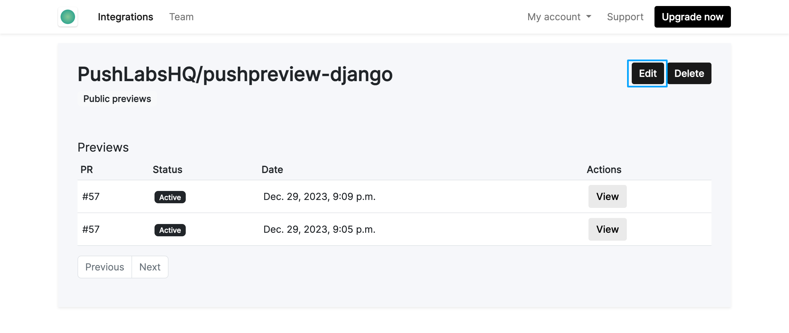

# Private previews

Previews generated through PushPreview are public by default, allowing anyone with the link to access them. However, for added security or to maintain confidentiality, PushPreview provides an option to set these previews to be private. This ensures that only authorized viewers can see them, making it a crucial feature for sensitive or confidential projects.

Private previews work by restricting access to users who have `READ` permissions over the repository linked to the preview.
This means that only team members or collaborators with the necessary permissions can view the private previews.

There are two ways to enable private previews: setting them as private by default for your entire team or marking individual integrations as private.

## Enable private previews by default

To make all previews private by default for all your integrations, follow these steps:

1. Log in to your PushPreview account.
1. Navigate to the **Team** page.
1. Turn on the **Private previews** option.

    

1. Save the changes.

This setting ensures that every new preview generated will be private, accessible only to users with the appropriate permissions.

## Mark individual integrations as private

For more granular control, you can set privacy settings on a per-integration basis:

1. Log into your PushPreview account.
1. Navigate to the **Integrations** page.
1. Choose the integration you want to modify.

1. Click **Edit**.

    

1. Enable the **Private previews** option.

    

1. Save the changes.

This option is ideal for teams that require different privacy levels for various integrations, allowing flexibility and control over who can access specific previews.

